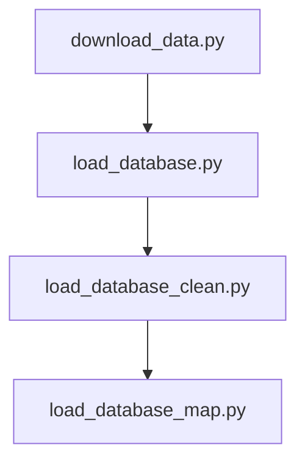

# BGD

## [Datasource](https://www.nyc.gov/site/tlc/about/tlc-trip-record-data.page)

Yellow and green taxi trip records include fields capturing pickup and drop-off dates/times, pickup and drop-off locations, trip distances, itemized fares, rate types, payment types, and driver-reported passenger counts. The data used in the attached datasets were collected and provided to the NYC Taxi and Limousine Commission (TLC) by technology providers authorized under the Taxicab & Livery Passenger Enhancement Programs (TPEP/LPEP). The trip data was not created by the TLC, and TLC makes no representations as to the accuracy of these data.

### [Data dictionary](https://www.nyc.gov/assets/tlc/downloads/pdf/data_dictionary_trip_records_hvfhs.pdf)

## Problem statement:
Predicting how likely is that taxi trip will resoult in a tip.
## Data risks:
- Ingesting data to database directly from drive instead of using insert statements.
- Most of the trips have 0 tip, so it might be necessary to remove a lot of data from the dataset to balance the data.
- Reading data from dataset for training might prove difficult, because of its size.

## Database schema:

## Spark flow

